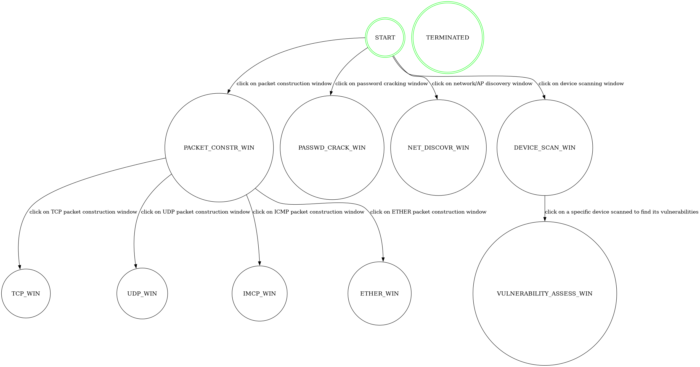
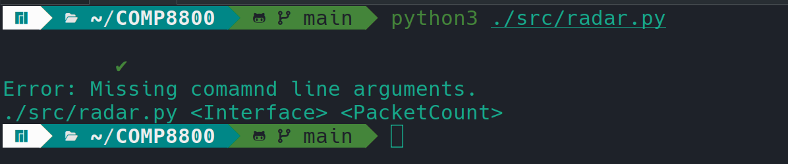
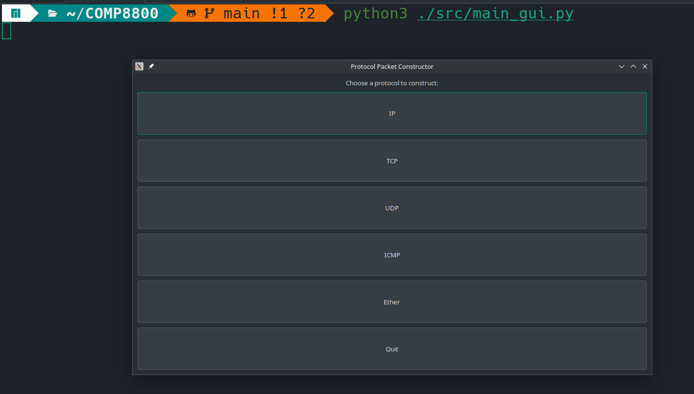

# COMP8800
COMP8800 project

A multi-purpose penetration testing tool capable of scanning entire networks and devices. This tool supports both Wifi scanning as well as Bluetooth scanning. Ports and services running on individual devices are scanned and compared against most up to date vulnerability databases and a detailed report is generated. 

### Requirements
- [] Python3
- [] Scapy
- [] PyGTK

./src/radar.py <Interface> <PacketCount>

### Highlevel FSM 

### Netwok Scanner Radar

### Packet Construction 

